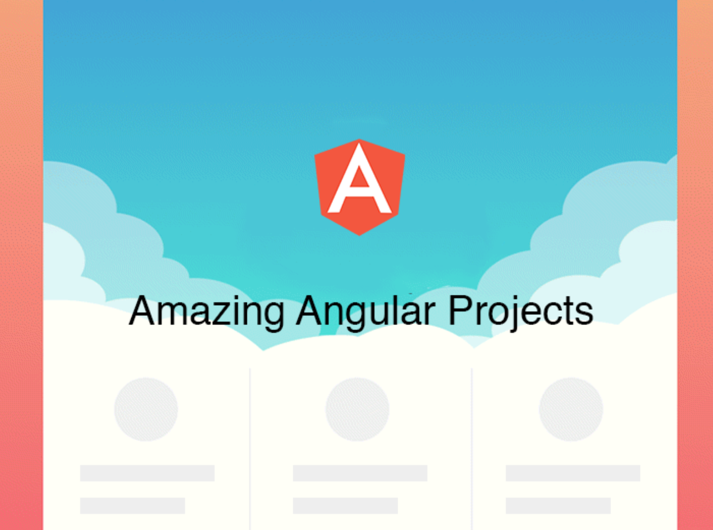

# Amazing Angular Projects
Collection of amazing open source Angular 1.x & Angular 2.0 projects

Originally published on <a href="https://medium.mybridge.co/18-amazing-open-source-angular-projects-dd9e81d921ee"> Medium </a>.

<a href="http://www.mybridge.co"> Mybridge </a> picked the top 18 Angular 1.x and Angular 2.0 apps out of nearly 550 open source projects. The average number of Github stars from the 22 projects was 683. If you know another open source project that is great, feel free to contribute. Let's make sure only full-working apps are included here.

#### Angular 1.x
* [Soundnode: Soundcloud for Desktop (Mac, Windows, and Linux), built with NW.js, Node.js, Angular.js, and with the Soundcloud API ★2442](https://github.com/Soundnode/soundnode-app)
* [Angular Bootstrap Admin Panel Framework ★3584](https://github.com/akveo/blur-admin)
* [ProtonMail: Encrypted Webmail Interface built with Angular ★1102](https://github.com/ProtonMail/WebClient)
* [Taiga: Project management app for agile developers & designers, built with Angular and Django. ★1970](https://github.com/taigaio/taiga-front)
* [Viktor NV-1: Open source musical instrument built with AngularJS & WebAudio API ★609](https://github.com/nicroto/viktor)
* [Malhar-angular-dashboard: Generic Dashboard/Widgets functionality with AngularJS. ★545](https://github.com/DataTorrent/malhar-angular-dashboard)
* [DuckieTV: A web app built with AngularJS to track your favorite TV-shows with semi-automagic torrent integration.) ★373](https://github.com/SchizoDuckie/DuckieTV)
* [A drum machine built with AngularJS. ★46](https://github.com/dougjohnston/angular-drum-machine)
* [Aisel: e-commerce marketplace built with AngularJS and Symfony3. ★189](https://github.com/ivanproskuryakov/Aisel)

#### Angular 2.0 
* [Angular 2 admin panel framework. ★907](https://github.com/akveo/ng2-admin)
* [Example Chat Application using RxJS and Angular 2. ★634](https://github.com/ng-book/angular2-rxjs-chat)
* [HackerNews made with AngularJS 2.0. ★103](https://github.com/hswolff/hn-ng2)
* [Echoes Player build with angular 2 ★74](https://github.com/orizens/echoes-ng2)
* [Dribbble Clone: Angular 2 playground using TypeScript and SystemJS loader. ★74](https://github.com/mohammedzamakhan/ng2-dribbble)
* [Angular 2 Trello Clone ★19](https://github.com/mrf28/a2gtm)
* [Angular 2 Chess Game. ★11](https://github.com/shlomiassaf/ng2-chess)
* [A YouTube Search Engine built with Angular 2.0. ★85](https://github.com/alexhawkins/angular2-tuber)
* [Angular 2 based piano note training game. ★2](https://github.com/JosephWoodward/Angular2PianoNoteTrainingGame)

